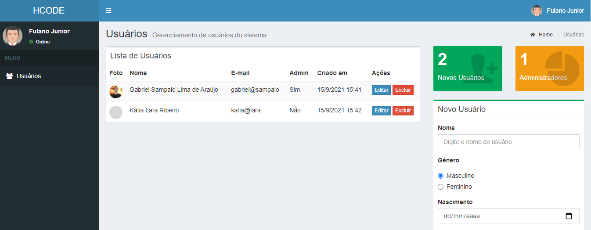
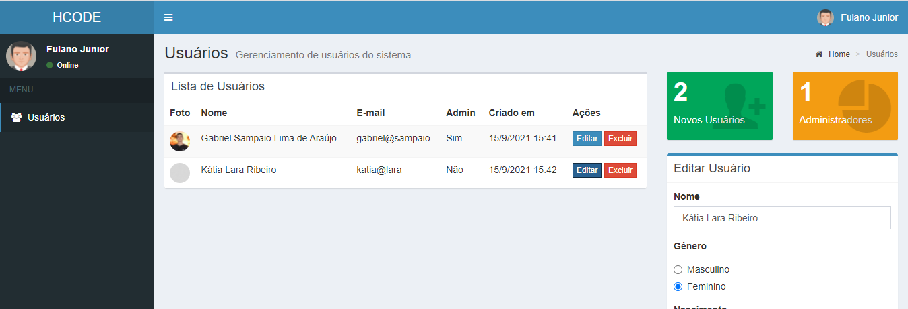

# CRUD HTML-CSS-JS - Template Admin

Olá, este projeto foi realizado utilizando o curso JavaScript - Curso Completo pela <a href="https://www.hcode.com.br/">HCODE</a>

O projeto foi desenvolvido utilizando apenas HTML, CSS e JavaScript. Nosso "banco de dados" fica no LocalStorage, assim guardando todas informações dos usuários cadastrados. 

Para poder visualizar o projeto, não é necessário rodar nada no terminal. Apenas clicar para abrir a página INDEX.HTML no seu navegador padrão, recomenda-se o Google Chrome versão atualizada.

## Preview

</img>
</img>

## 